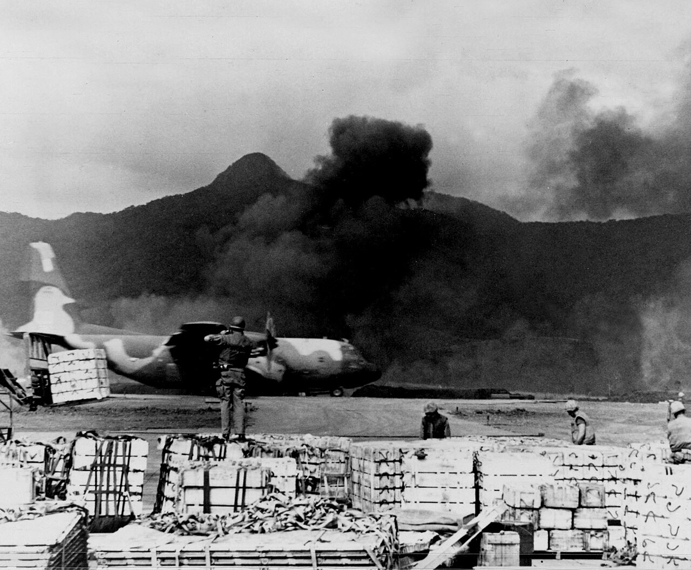
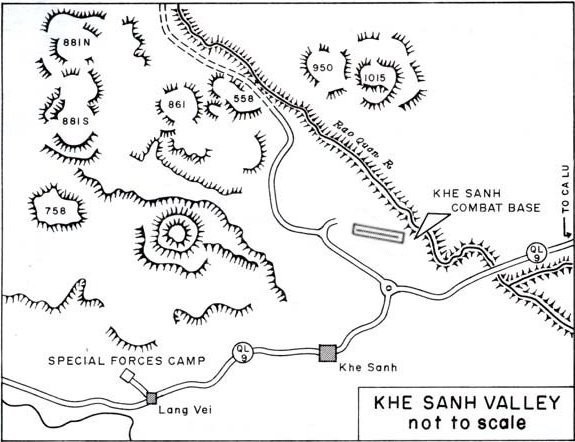

# Khe Sanh: Operation Niagara — Campaign Briefing Handbook

*The 414th's working reference for **Caucasus - Khe Sanh: Operation Niagara** (Caucasus map,
summer 1968). This is the **brief-builder**: accurate friendly order of battle, the win
geometry, the political-will/ROE layer, a fill-in mission-brief template, package recipes, a
comms/FAC card, the AAA threat-defeat reference, and a phased campaign plan. Print it, fork it,
scribble on it.*


<sub>The lifeline under fire — a C-130 on the Khe Sanh strip, 1968. *USAF photo (public domain), via Wikimedia Commons; full [image credits](khe-sanh-visual-briefing.md#image-credits--sources).*</sub>

> 🟢 **Provenance & confidence — read this.** This handbook is read **straight from the campaign
> files** — `resources/campaigns/khe_sanh_niagara.yaml`, `resources/factions/USA 1970 Vietnam War.json`,
> and `resources/factions/nva_1970.json` — and the campaign has now been **flown live** (July 2026
> sessions): the phase ribbon, the authored Rolling Thunder → Linebacker II arc, and the AI's ROE
> obedience are all **verified in-game** (the full arc ran turn 1 → 8 → 11 → 16 exactly as authored,
> with zero AI violations). The old 🟡 flags are resolved: the **SAM laydown is final** (the miz was
> fully rebuilt — AAA belt at the perimeter, exactly **4 SA-2 sites in the deep rear**), and
> **Combat SAR's rescue scoring is live and verified** (the newer capture/POW pieces are still being
> shaken out — see §12).

> ⚠️ **Mods/modules required.** This campaign won't load or spawn correctly without the period
> content it's built on. From the campaign + faction files: **Vietnam War Vessels**,
> **OV-10A Bronco mod**, **Community A-4E**, **OH-6 + Vietnam asset pack**, **Russian Military
> Assets Pack** (`[CH]` T-54/ASU-85), **High Digit SAMs Ultimate** (the NVA's P-37 EWR), plus the
> era modules it slots — **A-1 Skyraider, F-8E, A-6,
> F-100, F-4E, B-52, C-130J**. **See [Khe Sanh — Required Mods](https://github.com/bradyccox/414Ret/wiki/Khe-Sanh-Required-Mods)** for the
> full install list (what each adds, free vs paid, and download links). Make sure your squadron's
> install matches before op night.

> 🗓️ **The date.** The campaign clock starts **15 July 1968** — a map concession, not a history
> change: a 21 January start puts snow on Kutaisi, and the Vietnam highlands were never white. The
> *history* this campaign plays — the siege, Niagara, Pegasus — ran **21 Jan – 9 Apr 1968**; the
> year is kept so the era weapon-date gating stays honest.

---

## Table of contents

1. [Campaign at a glance](#1--campaign-at-a-glance)
2. [Win conditions & how the siege breaks](#2--win-conditions--how-the-siege-breaks)
3. [The war upstairs — political will & the ROE arc](#3--the-war-upstairs--political-will--the-roe-arc)
4. [Friendly order of battle (real, from the campaign)](#4--friendly-order-of-battle)
5. [The enemy in one screen](#5--the-enemy-in-one-screen)
6. [Campaign CONOPS — the phase plan](#6--campaign-conops--the-phase-plan)
7. [Weekly op-night runbook](#7--weekly-op-night-runbook)
8. [The mission brief template (fill-in)](#8--the-mission-brief-template)
9. [Package recipes](#9--package-recipes)
10. [Comms, FAC & code-word card](#10--comms-fac--code-word-card)
11. [Threat-defeat quick reference (it's an AAA fight)](#11--threat-defeat-quick-reference)
12. [Combat SAR & the POW clock](#12--combat-sar--the-pow-clock)
13. [Loadout & role pairing notes (1968)](#13--loadout--role-pairing-notes)
14. [Appendix A — blank one-page brief sheet](#appendix-a--blank-one-page-brief-sheet)
15. [Appendix B — mission log / debrief sheet](#appendix-b--mission-log--debrief-sheet)

---

## 1 · Campaign at a glance

| Item | Value |
|---|---|
| **Campaign** | Caucasus - Khe Sanh: Operation Niagara (fork of NoGoodNews' *1968 Yankee Station*) |
| **Theater** | Caucasus (NW-Vietnam highlands mapped onto the foot of the Caucasus range) |
| **Date / setting** | Summer 1968 campaign clock (see the date note above) — the siege of Khe Sanh; *Operation Niagara* air umbrella |
| **Our side** | **USA 1970 Vietnam War** — Marine/Navy/USAF/Army air, the carriers on Yankee Station |
| **Enemy** | **NVA 1970** — ground-heavy (armor + artillery + AAA), air-light (token guns-only MiG-17s) |
| **Posture** | **Asymmetric.** Blue owns the air; red owns the ground and the initiative. Keep the base alive, then break the siege. |
| **Economy skew** | Blue favoured — start $3000 / income ×1.5 vs red $1500 / ×1.2 (red's money feeds the ground) |
| **Front reinforcements** | `automate_front_line_reinforcements: true` — the siege axis keeps pressing on its own |
| **Threat profile** | **Wall-to-wall AAA** (12.7–57 mm + radar Shilka), armor at Lang Vei, exactly 4 SA-2 in the deep rear. **No MANPADS** (none existed in 1968). |
| **The Vietnam layer** | **Political will + Regime Resolve** meters, the **negotiation ending**, the **static front**, and the authored **Rolling Thunder → Linebacker II ROE arc** — see §3 and the [Vietnam Campaign Layer](https://github.com/bradyccox/414Ret/wiki/Vietnam-Campaign-Layer) page |
| **Vietnam Ops suite** | All ON except naval gunfire (inland siege): Arc Light, flak gauntlet, **convoy interdiction (Route 9)**, **airbase harassment** (the strip takes rocket/mortar fire), **Super Gaggle**, FAC(A) willie pete, snake-and-nape — see [Vietnam Ops](https://github.com/bradyccox/414Ret/wiki/Vietnam-Ops) |
| **Era gating** | `restrict_weapons_by_date: true` — the loadout editor enforces 1968 stores; the MiGs' missiles are gated out the same way |
| **Difficulty cushions** | `invulnerable_player_pilots: true`, `player_skill: Excellent`, enemy `Average`, day-only missions, `squadron_start_full: true` |
| **Module note** | Many airframes are modern stand-ins for the period type (AH-1W for AH-1G, A-6E for A-6A, F-4E for F-4B/C, CH-53E for CH-53) |

**The one-sentence situation:** two NVA divisions have ringed the Marine base at Khe Sanh; the only
way in is by air — **hold the perimeter with round-the-clock tac air, Arc Light, and airlift, then
break the siege while Washington's patience and Hanoi's resolve race each other to zero.**

---

## 2 · Win conditions & how the siege breaks

This is a **dynamic campaign** built around a **siege topology** — and since the Vietnam campaign
layer landed, it has **two endings racing each other** on top of the territorial one.


<sub>The real ground the layout abstracts: the base + airstrip, the hill outposts, Route 9 east, and Lang Vei to the SW. *Public domain; see the [visual briefing](khe-sanh-visual-briefing.md) for the aerial + Jan-1968 disposition map and full [credits](khe-sanh-visual-briefing.md#image-credits--sources).*</sub>

**The map (Caucasus → Vietnam):**

| Vietnam | Caucasus CP | Side | Role |
|---|---|---|---|
| **Khe Sanh Combat Base** | **Kutaisi** | BLUE | the besieged base — air-only resupply (starts at **0.25 strength**) |
| Hill 881S (forward outpost) | **Hill 881S FOB** | BLUE | blue forward FOB, airlift-supplied with Kutaisi |
| The hills (881/861/558) + NVA rear | **Sukhumi** | RED | the NVA staging base NW — and the **ROE sanctuary** (§3) |
| Route 9 / Pegasus axis | **Senaki** | RED | the siege spearhead — **the one front** (token MiG-17s here) |
| Lang Vei SF camp | **Kobuleti** | RED | SW — the **armor threat** (PT-76 / `[CH]` T-54) feeding the spearhead |
| Da Nang (tac-air rear + relief) | **Batumi** | BLUE | main blue tac-air base (air-only pocket) |
| Yankee Station | **Naval-1 / Naval-2** | BLUE | the carriers offshore (A-4/A-6/F-8/RA-5/E-2) |
| Deep-east rear | **Tbilisi-Lochini** | BLUE | the heavy rear: fast jets, B-52 Arc Light, EC-121, tanker, airlift |

**The siege geometry — a single axis.** The siege is **one front**: **Senaki → Kutaisi (Route 9)**
is the only blue↔red land link, held ~7 km off the wire by Kutaisi's 0.25 starting strength. The
other NVA bases don't open fronts of their own — **Sukhumi (the hills) and Kobuleti (Lang Vei) feed
Senaki by red↔red road**, so all the NVA logistics funnel through the Senaki bridges. **Every red
supply leg crosses a destructible bridge — cut a span and the whole siege chokes.** Blue's other
holding (Batumi + the carriers) is a separate air-only pocket.

**The static front changes how the siege breaks.** `vietnam_static_front` is ON: the front line
**bends but never sweeps** — it is clamped to a band around its campaign-start anchor, so the
strength battle presses the wire, feeds the will economy, and never simply rolls over Kutaisi (or
rolls you into Senaki). What that means in both directions:

- **You can't lose the base to a quiet turn** — but a collapsing perimeter still bleeds Political
  Will (§3), which is how you actually lose.
- **The ground relief is not a front-sweep.** Operation Pegasus in this build is an **Air Assault
  operation**: heliborne captures (UH-1H/CH-53E) are the territorial lever that flips CPs and
  breaks the ring, with the front-line grind setting the conditions.

**The three ways this campaign ends:**

1. **WIN — negotiation:** grind **Hanoi's Regime Resolve** to zero (attrit the ground force, kill
   the trail logistics, hold the base) before your own Political Will collapses — *"Hanoi agrees to
   terms."* This is the ending the air war is built to force.
2. **WIN — territory:** the classic map win still stands — relieve Kutaisi and take the enemy's
   bases via the Air Assault lever.
3. **LOSS — will collapse:** bleed Political Will to zero (lost airframes — **B-52s count extra** —
   pilots left as POWs, ROE violations, a starving garrison) and *"Washington orders withdrawal."*

> **Tempo:** unlike a SAM-belt air war, the limiting factor here is **how fast you can grind the
> ring** while the airlift keeps the garrison fed — and now, **how well you manage the two meters**.
> Air superiority is essentially free — spend your sorties on the ground fight, not on chasing MiGs.

---

## 3 · The war upstairs — political will & the ROE arc

*The generic mechanics are documented on the **[Vietnam Campaign Layer](https://github.com/bradyccox/414Ret/wiki/Vietnam-Campaign-Layer)**
page — this section is the Khe Sanh-specific playbook. Both meters and the current phase show live
on the **campaign status ribbon** above the map, and the kneeboard **cover page spells the ROE
out** (off-limits zones / locked classes) every mission.*

**The two meters.** **BLUE Political Will** (Washington's patience) drains on lost airframes
(weighted — **a lost B-52 hurts several times more than a lost Skyhawk**), on **pilots held as
POWs (every turn they're held)**, and on **ROE violations**. **RED Regime Resolve** (Hanoi's
capacity to keep bleeding) drains on ground attrition and trail losses. First meter to zero ends
the war (§2) — if both collapse at once, Washington folds first. This is Westmoreland's problem
made playable: the LBJ situation-room photo in the [intel pack](khe-sanh-intel-assessment.md) is
literally this mechanic.

**The authored ROE arc.** The campaign ships a four-phase Rolling Thunder → Linebacker II arc.
Phases advance **on schedule** (`min_turn`) — or **faster if your will is bleeding** (Washington's
patience for restraint runs out). The player is never hard-blocked: strike into a sanctuary and the
bombs land, but **Political Will pays the bill**. The AI planner obeys the ROE strictly (verified
in-game — zero violations across the full arc).

| Phase | Arrives | The rules | Red's answer |
|---|---|---|---|
| **Rolling Thunder** | turn 1 | **Northern sanctuary: 20 NM around Sukhumi** off-limits. Deep target classes **locked**: factories, power, oil/fuel, ammo, comms, warehouses, **airfields**. Fight the perimeter + the road. | — |
| **The Bombing Halt** | ~turn 8 (sooner if will < 75) | Sanctuary **expands to 28 NM** — Washington is talking. Deep classes stay locked. | **Trail surge** — double convoy flow down Route 9 — and Hanoi's **resolve regenerates** while you wait. The Halt is a trap for the passive. |
| **Linebacker** | ~turn 11 (sooner if will < 65) | The gloves come part-way off: **all target classes release** (airfields included); sanctuary shrinks to an **8 NM inner ring**. | A **3-turn ground offensive** — the NVA's Easter-style push against the clamped front. Expect the wire to get loud. |
| **Linebacker II** | ~turn 16 (sooner if will < 50 or the IADS is gutted) | **No sanctuaries, no locked classes.** Maximum effort — break Hanoi's resolve by force. | — |

**What this means for the plan:**

- **Turns 1–7 are a perimeter and interdiction war by law, not just by taste.** The deep targets
  you'll itch to hit (Senaki's airfield, the ammo dumps, the depots) are locked, and the Sukhumi
  staging base sits inside the sanctuary. The **armor, artillery, AAA, convoys, and bridges are
  all legal** — that IS the Rolling Thunder experience.
- **During the Halt, fly harder, not softer.** The sanctuary grows, but the trail surges and
  Hanoi's resolve *heals*. Kill the surging convoys (right-click the Route 9 supply route to frag
  an Armed Recon interdiction package straight onto it) and keep grinding the legal target set.
- **Linebacker is the pivot turn.** The moment the classes release, the campaign becomes a
  rollback: strike the freed depots and the airfield while weathering the 3-turn ground push.
- **Restricted zones draw on the map** (red dashed rings) and **locked targets wear a RESTRICTED
  badge** on their tooltip — if the map says no, the will meter agrees.
- **Watch the meters before you pick a fight.** A sloppy turn (a BUFF fed to the flak, two pilots
  captured, a sanctuary strike) can advance the arc *and* gut the will that pays for the endgame.

---

## 4 · Friendly order of battle

*Exact, from `khe_sanh_niagara.yaml`. All airframes are player-flyable era types (some modern
stand-ins). Sizes are starting squadron strength — the wing was deliberately **halved** from the
first build so `squadron_start_full` is manageable; expect a lean force where every airframe
matters (and every loss shows on the will meter).*

### Kutaisi — **Khe Sanh Combat Base** (the besieged garrison)

| Squadron airframe | Role | Size |
|---|---|---|
| **AH-1W SuperCobra** | CAS | 2 |
| **OV-10A Bronco** | CAS / **FAC(A)** | 2 |
| **A-1H Skyraider** | CAS (forward "Sandy") | 2 |
| **UH-1H Iroquois** | Air Assault (medevac/resupply) | 2 |

### Batumi — **Da Nang** (forward tac-air strip)

| Squadron airframe | Role | Size |
|---|---|---|
| **A-1H Skyraider** | CAS | 4 |
| **F-8E Crusader** | BARCAP | 4 |
| **CH-53E** | Air Assault (heavy lift) | 2 |
| **UH-1H Iroquois** | Air Assault | 2 |

### Tbilisi-Lochini — **deep-east rear** (fast jets + heavy fixed-wing)

| Squadron airframe | Role | Size |
|---|---|---|
| **F-100D Super Sabre** | CAS | 6 |
| **F-4E-45MC Phantom II** | Strike | 6 |
| **RF-101B Voodoo** | **TARPS photo recon** (unarmed) | 2 |
| **B-52H Stratofortress** | Strike (**Arc Light**) | 2 |
| **EC-121D Warning Star** | AEW&C | 2 |
| **KC-135 Stratotanker** | Refueling (**boom**) | 2 |
| **C-130J-30** | Transport (**Khe Sanh airlift**) | 2 |

### Naval-1 — carrier on **Yankee Station**

| Squadron airframe | Role | Size |
|---|---|---|
| **E-2C Hawkeye** | AEW&C | 2 |
| **F-8E Crusader** | BARCAP | 6 |
| **A-4E Skyhawk** | Strike | 6 |
| **A-4E Skyhawk** | Strike | 6 |
| **RA-5C Vigilante** | **TARPS photo recon** (unarmed) | 2 |

### Naval-2 — carrier (Bon Homme Richard)

| Squadron airframe | Role | Size |
|---|---|---|
| **A-6E Intruder** | Strike (all-weather) | 6 |
| **A-4E Skyhawk** | CAS | 6 |

**Reading the roster for tasking:**

- **CAS / FAC — the main effort.** A-1H Skyraider (the iconic "Sandy", Kutaisi + Da Nang), A-4E
  Skyhawk (carriers), F-100D (Tbilisi), AH-1W gunships, and the **OV-10A Bronco** as your **FAC(A)**
  (the faction's JTAC airframe — and the [willie-pete marking](https://github.com/bradyccox/414Ret/wiki/Vietnam-Ops#7--faca-willie-pete-target-marking)
  runtime rides it). This is where most sorties go.
- **Strike / interdiction.** A-6E (all-weather, big bomb load), F-4E (Tbilisi), A-4E. Hit the hill
  artillery, the Lang Vei armor, and the supply road/bridges — **mind the ROE arc (§3)** for
  anything deeper.
- **Arc Light.** B-52H out of Tbilisi — area saturation on massed NVA. Only two airframes, and a
  lost BUFF is a **political-will crater** — never send one where the 57 mm lives without thinking.
- **Air superiority (cheap).** F-8E Crusader (Da Nang + carrier) and the F-4E cover the token
  MiG-17 presence at Senaki. AIM-9 + guns — and that's plenty here.
- **Recon — TARPS, not armed recon.** The RF-101B and RA-5C are **unarmed photo birds** flying
  [TARPS](https://github.com/bradyccox/414Ret/wiki/TARPS-Reconnaissance): their film **confirms BDA and lifts the recon fog** (what you
  haven't photographed, you don't truly know). Player-crewed recon films via the F10 menu; AI-flown
  recon that survives to overfly its target confirms it automatically. They fly TARPS only — the
  planner will never send them on strikes.
- **Lift / lifeline.** C-130J (the Khe Sanh airlift), UH-1H (medevac/resupply), CH-53E (heavy
  lift) — and the same helos are your **Air Assault / Pegasus lever** (§2).
- **Enablers.** EC-121D + E-2C for the air picture, KC-135 boom tanker.

> ⚠️ **Tanker gotcha (plan around it):** only the **boom KC-135** is fragged (at Tbilisi). It feeds
> the **USAF jets** — F-100D, F-4E, RF-101B, B-52H. The **Navy/Marine probe jets** (A-4E, A-6E,
> F-8E, A-1H) have **no drogue tanker** in the laydown — they rely on **short legs from the carrier
> / Da Nang** and hot-pit turns. Keep their fragged ranges honest, or add a KC-130/S-3B drogue
> tanker squadron if you want carrier-jet AAR.

---

## 5 · The enemy in one screen

The NVA are **ground-heavy and air-light** — historically right. The campaign is **not** an
air-superiority or SEAD fight; it's about surviving the guns and killing the ground force.

**Air — token, guns-only, and it fights like 1968.**
- **MiG-17F Fresco** (×8, BARCAP) at **Senaki** — the *only* fielded fighters near the front. The
  era date-gating strips their missiles, so they're **guns-only knife-fighters** — and the NVA
  doctrine flies them as **GCI ambushers**: they scramble **late**, slash **one pass** through a
  strike package close to its target, refuse to chase far from their field, and run home. Don't
  get slow and low with one; keep energy, let the F-8/F-4 swat them — and **don't chase them into
  the sanctuary ring** (§3).
- **Mi-8 Hip** at Sukhumi (CAS) and Senaki (transport) — the NVA's own lift/light-attack.

**Ground — the real fight (BAI/CAS targets).**
- **Armor at Lang Vei (Kobuleti):** **PT-76** amphibious tanks and **`[CH]` T-54 MBT** (plus
  `[CH]` ASU-85, T-55A) — the campaign's signature armor threat. Historically the PT-76
  overran Lang Vei on 7 Feb '68 — the first NVA armor in the South.
- **Artillery on the hills (Sukhumi axis):** **BM-21 Grad** and towed guns ringing the base.
- **Infantry** massing on the perimeter — the Arc Light / TIC targets.
- **The trail on Route 9:** with **convoy interdiction** on, a real, tracked supply column keeps
  flowing down the road behind the front — kill it and those reinforcements never arrive; let it
  through and they do. It **surges during the Bombing Halt** (§3).

**Air defense — AAA is the threat, not SAMs.** The miz was rebuilt by hand around this:

| System | Type | Note |
|---|---|---|
| **ZSU-23-4 Shilka** | Radar-directed 23 mm SPAAG | The dangerous one — accurate, tracks. Respect it. |
| **ZSU-57-2** | 57 mm SPAAG (optical) | Heavy hitter up to medium altitude. |
| **S-60 57 mm** | Towed radar/optical 57 mm | Reaches ~medium altitude; the classic NVA flak. |
| **ZU-23** (towed + on Ural) | 23 mm autocannon | Everywhere; deadly low. |
| **SA-2** | Strategic SAM | **Exactly 4 sites, deep rear only** — a Linebacker-phase problem, never a perimeter one. |
| **P-37 "Bar Lock" EWR** | Early-warning radar | **One site, the NVA deep rear** — the eyes feeding the SA-2 net and the MiG GCI (HDS ships ON; see [Required Mods](https://github.com/bradyccox/414Ret/wiki/Khe-Sanh-Required-Mods)). Kill it and the net goes blind. |

> The **AAA belt is ~30 emplacement groups** across the siege ring and the approaches, plus the
> [flak gauntlet](https://github.com/bradyccox/414Ret/wiki/Vietnam-Ops#2--aaa-flak-gauntlet) runtime: predictable, steady flying draws
> tightening barrage bursts; jinking loosens them. The **airstrip takes real harassment fire** too —
> the [airbase harassment](https://github.com/bradyccox/414Ret/wiki/Vietnam-Ops#5--airbase-harassment-rocketmortar-siege) runtime drops
> sporadic rocket/mortar barrages near the ramp of forward fields (a field a **player spawns at is
> never targeted** that mission — the anti-grief guarantee).

**Naval — minimal.** Small **patrol boats** only. No real surface threat; blue owns the water.

---

## 6 · Campaign CONOPS — the phase plan

The historical arc (Niagara → Pegasus) now rides the **authored ROE arc (§3)** — the phases below
line up with what the campaign itself will let you hit, and with how red answers. The automated
siege axis keeps pressing throughout; the early phases are about *not losing the base* while you
build toward the relief.

### Act I — Rolling Thunder: hold the perimeter, own the road *(turns 1–7)*
- **The law:** Sukhumi sanctuary (20 NM) + all deep classes locked. The perimeter fight and the
  road war are what's legal — so win those.
- **Objective:** don't lose Khe Sanh; blunt the assaults; keep Kutaisi + Hill 881S supplied; kill
  the guns, the Lang Vei armor, and every convoy on Route 9; **photograph everything** (TARPS) so
  the BDA is real.
- **Fly:** FAC-controlled CAS on the perimeter (A-1H, AH-1W, A-4E), the C-130 airlift, recon,
  BAI on the artillery + armor, bridge strikes, Arc Light on massed infantry (outside the
  sanctuary), light BARCAP.
- **Watch:** Political Will — losses and POWs now, patience later.

### Act II — The Bombing Halt: the trap for the passive *(~turn 8+)*
- **The law:** sanctuary expands to 28 NM; deep classes stay locked. **Red surges the trail and
  Hanoi's resolve regenerates.**
- **Objective:** deny the surge. Armed Recon lives on Route 9 (right-click the supply route to
  frag it); keep grinding armor/artillery; keep the garrison fat; take **Air Assault** bites where
  the ring is thin.
- **Win the Halt when:** the surge dies on the road and your will is still healthy when Linebacker
  arrives.

### Act III — Linebacker: the release & the push *(~turn 11+)*
- **The law:** everything releases except an 8 NM inner ring; **red mounts a 3-turn ground
  offensive** against the clamped front.
- **Objective:** survive the push (the perimeter CAS war comes back hard), then roll back the
  freed target set — the depots, the ammo, **Senaki airfield** — while the front is spent.
- **Fly:** everything. This is the maximum-tempo stretch of the campaign.

### Act IV — Linebacker II / Pegasus: break them *(~turn 16+)*
- **The law:** no sanctuaries, no locked classes.
- **Objective:** force the ending — grind **Regime Resolve** to zero with the full target set, or
  finish the territorial relief with **Air Assault** captures up the Route 9 axis (the static
  front means the helos, not the front line, take the ground — §2).
- **Win when:** *"Hanoi agrees to terms"* — or the ring is yours.

> Carry one idea through every act: **the air keeps the base alive; the ground fight and the two
> meters win it.** Don't let the airlift lapse while you chase the offensive.

---

## 7 · Weekly op-night runbook

A repeatable Saturday flow. The **mission commander (MC)** owns the plan; everyone else fills it.

**Before op night (MC, in the Retribution tool):**
1. Sync the save; read last turn's **SITREP** (losses, base captures, rescues, the will band) on
   the kneeboard cover page, and the **campaign status ribbon** (phase + both meters) over the map.
2. Check the **ROE**: the cover page lists off-limits zones and locked/cleared classes; the map
   draws the sanctuary rings. Plan inside the law — or price the violation consciously.
3. Pick **this turn's objective** off the phase plan (§6): one main effort (perimeter CAS /
   anti-armor / trail interdiction / release-day rollback) + the standing airlift.
4. Lay the **packages** (§9): main-effort CAS or BAI under a FAC, an Arc Light if there's a massed
   target outside the sanctuary, the C-130 airlift, light BARCAP, TARPS on anything you plan to
   claim killed, and a Combat SAR alert if helos are free.
5. Assign **player slots** to the sorties that matter; let the AI fill BARCAP/lift.
6. Generate the mission. Confirm the FAC/JTAC is set, day-only is on, and kneeboards generated.

**At the brief (MC, ~10 min):** run the §8 template. Emphasise the **gun threat**, **run-in
discipline**, and **this phase's ROE** (this campaign kills you with flak and loses you with the
will meter).

**Flight leads:** brief your flight's game plan, FAC contract, and comms off the package brief.

**After the flight (MC):** run the §Appendix B debrief, fly the turn, capture the SITREP — and
note both meters' movement.

**Role slate (assign each op night):**

| Role | Typical airframe | Job |
|---|---|---|
| Mission Commander | any | Owns the plan, the timeline, and the ROE call |
| FAC(A) | OV-10A Bronco | Finds targets, marks (willie pete), controls the CAS stack |
| CAS lead | A-1H / A-4E / F-100D / AH-1W | Puts ordnance on the perimeter under the FAC |
| Anti-armor lead | A-6E / A-4E | Kills the Lang Vei armor |
| Trail interdiction | A-1H / A-4E / A-6E | Armed Recon on Route 9 — the convoy war (right-click the route) |
| Arc Light | B-52H | Area saturation on massed NVA — outside the sanctuary, always |
| BARCAP | F-8E | Swats the ambushing MiG-17s (cheap insurance) |
| Airlift | C-130J / UH-1H | Keeps Khe Sanh + Hill 881S fed |
| Air Assault | UH-1H / CH-53E | The Pegasus lever — heliborne captures when the ring thins |
| Recon | RF-101B / RA-5C | **TARPS film** — confirms the BDA, lifts the fog |
| Sandy / CSAR | A-1H + UH-1H/CH-47F | Rescues downed aircrew — before the snatch teams get them (§12) |

---

## 8 · The mission brief template

*Copy this for each mission. Fill the brackets. A stripped one-pager is in
[Appendix A](#appendix-a--blank-one-page-brief-sheet).*

```
======================  KHE SANH — MISSION BRIEF  ======================
OP / TURN / DATE: Niagara · Turn [N] · 15 JUL 1968 (+[turns])
MISSION #: [____]      MC: [callsign]

1. SITUATION
   Last turn (SITREP): [losses / front movement / base status / rescues]
   The meters: Political Will [___] · Regime Resolve [___] · Phase: [Rolling Thunder /
     Halt / Linebacker / LB II] — ROE: [zones + locked classes off the cover page]
   Siege now: [where the ring is; is the airlift flowing?]
   Enemy: [AAA known on this axis / armor or arty located / convoy on Route 9 / MiG note]
   Friendly: [adjacent packages, the ground push, airlift status]
   Weather / light: DAY. [ceiling / vis / wind]

2. MISSION (who-what-where-when-why)
   "[Package] will [task] [target] vic [hill/Lang Vei/Route 9] at [TOT]
    under [FAC callsign], in order to [phase objective]."

3. EXECUTION
   a. Commander's intent / main effort: [the one thing that must happen]
   b. Scheme of maneuver:
        - Push: [time]   IP / Contact pt: [point]   TOT: [time]
        - [Flight] — [role] — [run-in plan, FAC check-in, deliveries, egress]
   c. Game plan vs. the GUNS (this is an AAA fight — §11):
        - Hard deck / roll-in altitude: [stay above the auto-AAA floor]
        - Run-in: vary axis every pass; NO repeat passes on the same heading
        - Shilka (radar 23mm) called: [terrain-mask / re-attack from a new axis]
        - Egress: jink, don't dive low to admire the target
   d. ROE check: [target legal this phase? distance to the sanctuary ring?]
   e. Weapons / loadout per flight: [§13 — period iron; the editor enforces the era]
   f. FAC contract: [marks (Willie Pete), talk-on, line-up, cleared hot / abort]
   g. Success / abort criteria: [what "done" is; when to knock it off]

4. COORDINATION & COMMS (§10)
   FAC(A): [callsign / freq]   AWACS: [EC-121/E-2 callsign / freq]
   Tanker: [KC-135 / freq — USAF jets only]   Airlift window: [if deconflicting Kutaisi]
   Package freq: [____]   Guard: 243.0
   Code — PUSH [____]  CLEARED HOT [____]  ABORT [____]  TROOPS-IN-CONTACT [____]

5. ADMIN & SAR (§12)
   Bingo / Joker: [____]   Divert: [Da Nang/Khe Sanh/carrier]
   Combat SAR: Sandy [A-1H flight], pickup [UH-1H/CH-47F], freq [____]
   If you go down: [get clear, guard freq, Sandy runs it — the NVA WILL race you for
     the survivor; a captured pilot is a POW draining will every turn (§12)]

6. CONTINGENCIES
   - Weather below mins over the target: [divert / re-task]
   - FAC off-station: [hold / abort the CAS — no uncontrolled drops near the wire]
   - Airlift threatened: [escort / suppress the gun that's ranging the strip]
   - Heavy AAA on the briefed axis: [shift IP, attack from a new bearing]
   - Phase advanced mid-plan: [re-check the ROE before pushing]
========================================================================
```

---

## 9 · Package recipes

Fast templates for the tool. Scale to what's available and to the threat. Note how different this
is from a modern war — **no SEAD/DEAD packages** (the Vietnam doctrine drops them from the planner
entirely; Iron Hand rides the strike packages), and **air superiority is an afterthought**.

| Package | Core | Support | Notes |
|---|---|---|---|
| **FAC + CAS (the bread and butter)** | OV-10 FAC(A) + 2–4× A-1H / A-4E / F-100D | AH-1W gunships | The FAC finds/marks; CAS works the perimeter. Most sorties. |
| **Anti-armor (Lang Vei)** | 2–4× A-6E or A-4E (Rockeye/snake/napalm) | OV-10 FAC | Kill the PT-76/T-54 at Kobuleti. The signature BAI mission. |
| **Trail interdiction (Route 9)** | 2× A-1H / A-4E / A-6E Armed Recon | recon | **Right-click the enemy supply route on the map** — the package dialog opens pre-set on Armed Recon. The convoy war; decisive during the Halt surge. |
| **Arc Light** | 1–2× B-52H | (recon to fix the box) | Area saturation on massed infantry/arty. Deconflict the box hard; keep the BUFF out of the 57 mm and outside the sanctuary. |
| **Hill interdiction** | 2–4× A-4E / F-100D / A-6E | OV-10 FAC + recon | Beat down the perimeter artillery + AAA. |
| **Road/bridge interdiction** | 2× A-6E / A-4E | recon | Cut the destructible bridges — every red supply leg crosses one. |
| **BARCAP (cheap)** | 2× F-8E | EC-121 / E-2 picture | Ambushing MiG-17 insurance. Guns + AIM-9 is plenty. |
| **Airlift / resupply** | C-130J + UH-1H | (CAS on call) | Keep Kutaisi + Hill 881S fed. Protect the strip from ranging guns. |
| **Air Assault (Pegasus)** | UH-1H / CH-53E | CAS + FAC ahead of the LZ | **The territorial lever** — the static front never sweeps, the helos take the ground. |
| **TARPS recon** | RF-101B / RA-5C | — | Photograph the targets you struck (and the ones you plan to) — film is what turns "claimed" into confirmed. |
| **Combat SAR (§12)** | A-1H "Sandy" ×2 + UH-1H/CH-47F | AH-1W | Stand up when aircrew goes down — beat the snatch teams to the survivor. |

> Put a **FAC (OV-10)** over any CAS push — talk-ons and Willie-Pete marks are how you put iron on a
> gun or a bunker line you can't see from altitude, and how you keep drops off the friendly wire.
> The [FAC(A) marking runtime](https://github.com/bradyccox/414Ret/wiki/Vietnam-Ops#7--faca-willie-pete-target-marking) drops real white
> smoke on what the Bronco finds.

---

## 10 · Comms, FAC & code-word card

*Fill the blanks per mission; the structure stays constant. The **FAC(A)** is central here — more
like a JTAC brief than a strike-package brief.*

```
NETS
  Package (primary) ....... [____]      Guard ................... 243.0 / 121.5
  FAC(A) "[callsign]" ..... [____]      AWACS (EC-121/E-2) ..... [____]
  Tanker (KC-135, USAF) ... [____]      Airlift / Khe Sanh tower [____]
  Combat SAR (Sandy) ...... [____]      Ground / TIC net ....... [____]

THE 9-LINE (FAC to attack) — copy it down
  1 IP/BP   2 Heading   3 Distance   4 Target elev   5 Target desc
  6 Target location   7 Mark (WP/laser/talk-on)   8 Friendlies   9 Egress
  Readback: lines 4, 6, and restrictions. Wait for "CLEARED HOT".

CODE WORDS (set fresh each mission)
  PUSH ......... [____]   (commit / run-in)
  CLEARED HOT . [____]    (FAC clears the drop)
  ABORT ........ [____]   (knock it off — go around, no drop)
  TIC ......... [____]    (troops in contact — danger-close discipline)

KEY BREVITY
  CONTACT ............ I see the mark/target you called
  TALLY / NO JOY ..... I see the target / I don't
  IN (heading) ....... rolling in on the attack
  OFF (direction) .... off target, egressing
  WINCHESTER / BINGO . out of ordnance / fuel to RTB
  DANGER CLOSE ....... friendlies within risk distance — FAC must clear, read back
  GUNS / TRIPLE-A .... taking AAA (give type + clock + where)
```

> No "MAGNUM/MUD" SAM chatter here — the threat call that matters is **"GUNS, [clock], [type]"** so
> the flight can shift its run-in. And **danger-close** discipline near the wire is the whole ballgame.

---

## 11 · Threat-defeat quick reference

*This campaign kills you with **flak**, not missiles. Carry this on the kneeboard.*

### The guns (the everyday threat)

| Threat | Defeat |
|---|---|
| **ZSU-23-4 Shilka** | Radar-directed 23 mm — the accurate one. If it's up, **terrain-mask and re-attack from a new axis**; don't fly a predictable pattern in its arc. Kill it first if it's near your target. |
| **ZSU-57-2 / S-60 (57 mm)** | Reach up to medium altitude. **Roll in from above their effective ceiling, dive, deliver, egress jinking.** Don't loiter or make repeat passes on one heading. |
| **ZU-23 (23 mm) + 12.7/14.5 mm** | Lethal **low**. Stay above the auto-AAA floor near the target; if you must go low, go fast and unpredictable, one pass. |
| **The flak gauntlet (runtime)** | Steady heading + altitude **tightens** the barrage around you (and a long predictable run draws a close "tracking" round); **jinking widens it**. The mechanic literally rewards the golden rules below. |

**The golden rules (1968 tac-air):**
- **There are no MANPADS.** Medium altitude is comparatively safe — *use it*. The historical loss
  driver was diving into the auto-AAA envelope and making repeat passes.
- **Vary everything** — IP, run-in heading, roll-in altitude. The gunners learn a pattern fast.
- **One pass, haul ass** when the guns are hot. Let the FAC re-mark for the next jet, don't re-attack
  the same line.
- **Let the FAC find the gun.** A Willie-Pete mark on a flak pit is a target; an un-spotted gun is
  what gets you.
- **Every airframe is will.** A downed jet isn't just a lost sortie any more — it's a dent in the
  meter that ends the war, and possibly a POW (§12). Fly like Washington is watching, because it is.

### Air & SAM (minor here)
- **MiG-17F** — guns-only, flown as a **GCI ambush**: late scramble, one slash through the package
  near its target, then home on a short leash. Keep energy, don't slow-fight, don't chase it into
  the sanctuary; F-8/F-4 with AIM-9 + guns handle it. AWACS (EC-121/E-2) gives the picture.
- **SA-2** — exactly **4 sites, deep rear**. Irrelevant until you fly deep in Linebacker; then
  respect them the 1968 way (terrain, notching, don't fly steady at medium-high altitude in range).

---

## 12 · Combat SAR & the POW clock

A downed airman over the NVA-held hills is the COIN heart of this campaign — and it is now a
**campaign mechanic, not just mood**. Full system docs: [Combat SAR](https://github.com/bradyccox/414Ret/wiki/Combat-SAR).

**Why it matters to the meters:** a rescued pilot is **spared at debrief** (the airframe is still
lost, but the aviator returns to the squadron). A pilot the enemy reaches first becomes a
**POW — and every turn held drains Political Will**. Rescue is how you stop the bleed.

**How it plays:**
- **The race.** When a pilot ejects, an **enemy snatch party spawns and races you to the
  survivor** — several small dispersed teams. Kill or beat them to the pickup and the pilot is
  saved; lose the race and the pilot is **CAPTURED**.
- **The rescue package.** **Sandy** (A-1H) finds and protects the survivor and walks the helo in;
  the pickup is the **CH-47F "Jolly Green"** with the C-130 **"King"** overhead (air-tracking
  TACAN + F10 survivor locator). An **AI-crewed Sandy dynamically diverts** off its racetrack to
  hold and engage near a live ejection; a player Sandy flies it by voice, the way it should be.
- **The POW arc.** A captured pilot is held **at an enemy airfield** (a real map objective offering
  a CSAR raid). A **successful CSAR air-assault raid** — or **capturing the field** — frees the
  aviator. A POW abandoned past the **4-turn clock is killed**. The NVA fly no CSAR of their own —
  their ejections are simply gone (blue never races red).
- **The AI safety net.** `auto_combat_sar` (default **OFF**) can stand up an AI alert package
  (King + helo + Sandy) if the squadron wants coverage on nights nobody takes the seat.

**Status honestly:** the **rescue scoring loop is live and verified in-game** (delivered pilots are
spared; AI rescues credit the right survivor). The newer pieces — the King's TACAN beacon (fixed,
awaiting a re-fly), the POW recovery raid, and the Sandy auto-divert — are **built but still being
shaken out in-game**. Brief the race and the POW clock as real; expect rough edges on the raid.

- **`invulnerable_player_pilots: true` is set** for this campaign — your *own* pilot won't be killed
  in the cockpit. The ejection → rescue/capture arc is where the stakes live.

**Downed-airman contract (put it in §5 of the brief):** get off the LZ-side slope to defensible
cover, comms on the SAR/guard freq, let **Sandy** run the on-scene picture, authenticate per the
day's plan — and remember the other side is running for you too.

---

## 13 · Loadout & role pairing notes

Period 1968 — **dumb iron, napalm, rockets, and guns.** There are essentially no PGMs in this fight;
accuracy comes from the FAC, the dive, and the gun.

| Role | Airframe(s) | Typical period load | Notes |
|---|---|---|---|
| **CAS (prop)** | A-1H Skyraider | Mk-82/snakeye, napalm, LAU rockets, 20 mm | The loiter king. Sandy + perimeter CAS. |
| **CAS (jet)** | A-4E, F-100D | Mk-82/snake, napalm, Zuni, Mk-20 Rockeye, gun | Fast CAS under the FAC. |
| **Anti-armor** | A-6E, A-4E | **Mk-20 Rockeye**, snake, napalm | Rockeye is your armor-killer at Lang Vei. |
| **Strike / interdiction** | A-6E, F-4E | Mk-82/83/84, snake | A-6E = all-weather, big load; bridges + arty. |
| **Area saturation** | B-52H | Full conventional bomb bay | Arc Light boxes — deconflict hard. |
| **Gunship** | AH-1W | rockets + cannon (+ TOW where fitted) | Perimeter CAS, escort. |
| **FAC(A)** | OV-10A Bronco | **Willie Pete marking rockets** + LAU rockets + gun | Finds, marks, controls. The keystone. |
| **BARCAP** | F-8E Crusader | AIM-9 + 20 mm | "Last of the gunfighters" — perfect vs the MiG-17. |
| **Recon** | RF-101B, RA-5C | cameras only | TARPS film — confirm the BDA, lift the fog. |
| **Lift** | C-130J, UH-1H, CH-53E | — | The lifeline. C-130 = Khe Sanh airlift; the helos = Pegasus. |

**Tanker pairing (don't strand a striker):**
- **Boom (KC-135, the only one fragged):** F-100D, F-4E, RF-101B, B-52H.
- **Probe (no drogue tanker fragged):** A-4E, A-6E, F-8E — fly off the carrier / Da Nang ranges, or
  add a KC-130/S-3B drogue squadron.

> `restrict_weapons_by_date` is **ON** for this campaign — the loadout editor itself enforces the
> 1968 stores list (and gates era cockpit options), so the period iron above is what you'll
> actually be offered. Snakeye and napalm deliveries also feed the
> [snake-and-nape](https://github.com/bradyccox/414Ret/wiki/Vietnam-Ops#8--snake-and-nape-napalm-cas) low-pass runtime — press the run in
> low and fast over enemy ground and the swath is yours.

---

## Appendix A — blank one-page brief sheet

*Print one per flight lead.*

```
KHE SANH  ·  TURN [__]  ·  MSN #[____]            MC: [______]

CALLSIGN: [______]  AIRFRAME: [______]  #SHIP: [__]  ROLE: [__________]

PHASE / ROE: [__________]  WILL: [___]  RESOLVE: [___]
MISSION: ________________________________________________________________
TARGET / AREA: ________________________  TOT: [______]  PUSH: [______]
FAC(A): [__________]  FAC FREQ: [______]

RUN-IN PLAN:  IP [______]  ROLL-IN ALT [______]  AXIS (vary!) [__________]
HARD DECK: [______]   BINGO: [______]   JOKER: [______]   DIVERT: [______]

GUNS EXPECTED: _________________________________________________________
GAME PLAN: _____________________________________________________________

COMMS:  PKG [______]  FAC [______]  AWACS [______]  GUARD 243.0
CODE:   PUSH [____]  CLEARED HOT [____]  ABORT [____]  TIC [____]

LOADOUT: _______________________________________________________________
SAR: Sandy [______]  Pickup [______]   If down: ______________________
NOTES: _________________________________________________________________
```

---

## Appendix B — mission log / debrief sheet

*One per mission; feeds next turn's SITREP.*

```
KHE SANH DEBRIEF  ·  TURN [__]  ·  MSN #[____]  ·  [date]

OBJECTIVE THIS TURN: ____________________________________________________
RESULT:  [ ] MET   [ ] PARTIAL   [ ] NOT MET

PERIMETER: [ ] held  [ ] pressed  [ ] lost ground at ___________________
AIRLIFT INTO KHE SANH:  [ ] flowing  [ ] threatened by ________________
RED GROUND KILLED:  armor ____  arty ____  vehicles ____  convoys ____
BLUE LOSSES:  a/c ____  aircrew ____ (rescued __ / POW __ / down __)
THE METERS:  Political Will [___] (Δ __)   Regime Resolve [___] (Δ __)
PHASE: [______________]  ROE VIOLATIONS: ____
FRONT / PEGASUS PROGRESS (incl. Air Assault captures): _________________

WHAT WORKED: ___________________________________________________________
WHAT DIDN'T: ___________________________________________________________
NEXT TURN MAIN EFFORT (per §6): ________________________________________
```

---

*Grounded in `resources/campaigns/khe_sanh_niagara.yaml`, `resources/factions/USA 1970 Vietnam War.json`,
and `resources/factions/nva_1970.json`. Build/design notes:
[`docs/dev/design/414th-khe-sanh-campaign-notes.md`](https://github.com/bradyccox/414Ret/blob/main/docs/dev/design/414th-khe-sanh-campaign-notes.md);
the campaign-layer mechanics are documented on [Vietnam Campaign Layer](https://github.com/bradyccox/414Ret/wiki/Vietnam-Campaign-Layer) and
the period runtime suite on [Vietnam Ops](https://github.com/bradyccox/414Ret/wiki/Vietnam-Ops). The ROE arc and phase ribbon are
**verified in-game** (July 2026); the newest Combat SAR pieces (POW raid, Sandy auto-divert) are
still being flight-tested. Callsigns, frequencies, and code words are illustrative and freely
editable.*

