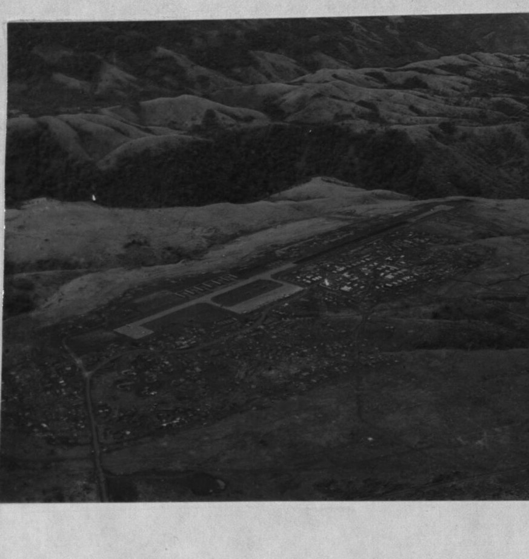
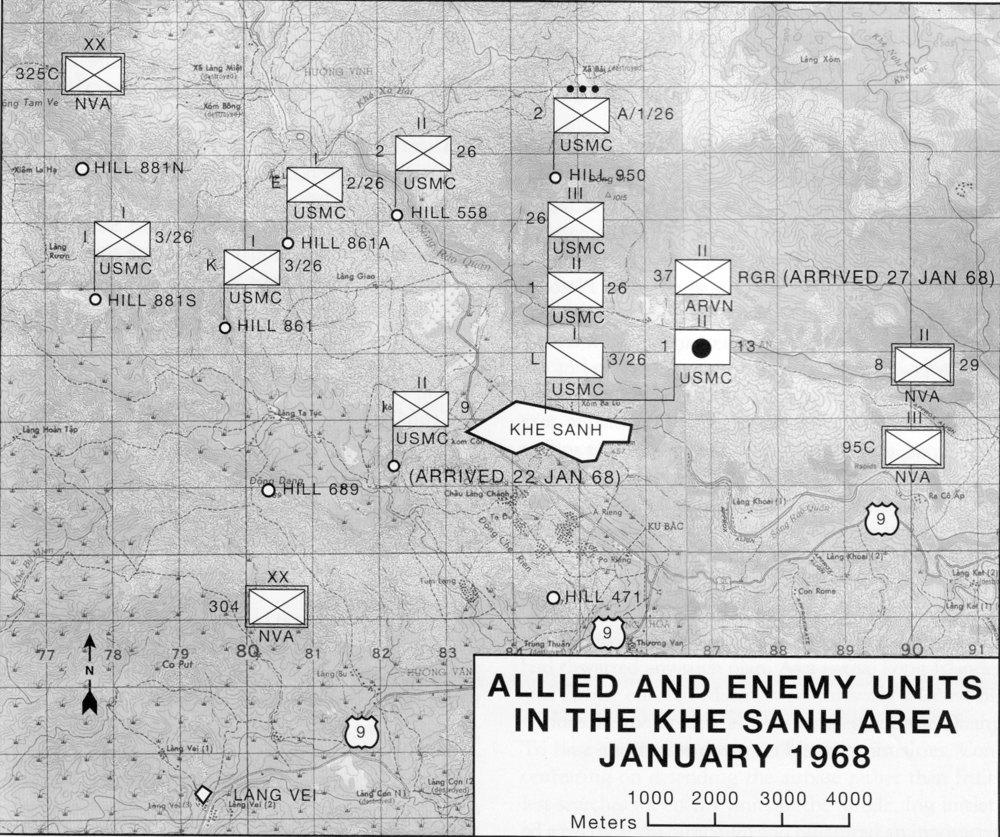

# Khe Sanh: Operation Niagara — Visual Briefing

*A picture brief for **Caucasus - Khe Sanh: Operation Niagara** — **real maps and aerial photography**
of the 1968 siege. For the full text product — the historical intelligence assessment, threat card,
and read-aloud brief — see **[khe-sanh-intel-assessment.md](khe-sanh-intel-assessment.md)**; for the
working brief-builder, the **[Campaign Briefing Handbook](khe-sanh-campaign-handbook.md)**.*

> 🟢🟡 **Rooted in history.** The map and aerial below are the **real** siege, mapped onto the
> Caucasus terrain for play. All imagery is **public domain** (US Government works) — full attribution
> in [Image credits](#image-credits--sources). Gameplay concessions (token MiG-17s, deep-rear SA-2,
> modern module stand-ins) are flagged in the intel pack.

---

## The base you're keeping alive — Khe Sanh from the air

**Khe Sanh Combat Base from the air, 1967** — the airstrip on its plateau, ringed by the hills the
NVA would seize. This is the field that must be kept alive by air alone — **Kutaisi** in the campaign.
*USMC photo (public domain).*

---

## The ground — the Khe Sanh valley

**The real terrain.** The combat base + airstrip, the hill outposts (**881S/N, 861, 558, 950**),
**Route 9 (QL-9)** east to Ca Lu, and the **Lang Vei** Special Forces camp to the southwest.
*Public domain.*

**How the ground maps onto the Caucasus play area:**

| Real place | Caucasus CP | Side |
|---|---|---|
| Khe Sanh Combat Base | **Kutaisi** (0.25 strength — besieged) | BLUE |
| Hill 881S outpost | **Hill 881S FOB** | BLUE |
| The hills + NVA artillery | **Sukhumi** | RED |
| Route 9 / Pegasus axis | **Senaki** | RED |
| Lang Vei (PT-76 armor) | **Kobuleti** | RED |
| Da Nang (tac-air rear + relief) | **Batumi** | BLUE |
| Yankee Station carriers | **Naval-1 / Naval-2** | BLUE |
| Deep rear (heavy jets, B-52, tanker) | **Tbilisi-Lochini** | BLUE |

---

## The siege — dispositions, January 1968

**Allied & enemy units, January 1968.** The **26th Marines** (1/26, 2/26, 3/26) hold the hill
outposts and the base with the **ARVN 37th Rangers** (arrived 27 Jan), ringed by the **NVA 304th,
325C, 320th and 95C** divisions and Route-9 approaches. *US Navy map (public domain).* The campaign
abstracts this as a single Route 9 siege axis — red **Senaki** presses blue **Kutaisi**, fed from the
NVA rear at **Sukhumi** (the hills) and **Kobuleti** (Lang Vei).

---

## The threat is flak, not missiles

No real MiG threat, no SAMs at the base, **no MANPADS** (none existed in 1968). You fly against
**guns** — and because there are no missiles, **medium altitude is comparatively safe**; the men who
died flew into the auto-AAA or made repeat passes.

| Threat | Type | The play |
|---|---|---|
| **ZSU-23-4 Shilka** | radar-directed 23 mm | accurate — terrain-mask, re-attack from a new axis |
| **ZSU-57-2 / S-60** | 57 mm (optical) | reaches medium alt — roll in from above, dive, egress jinking |
| **ZU-23 + 12.7/14.5 mm** | low auto-AAA | lethal low — one pass, vary heading, don't loiter |
| **The airstrip approach** | the gauntlet | guns range the Khe Sanh strip — suppress before the airlift commits |
| **MiG-17F (token) / SA-2 (depth)** | — | 🟡 gameplay only — no real MiG/SAM threat at Khe Sanh |

---

## Target priority — how the air war wins

1. **The artillery** — Co Roc 130/152 mm + the hill guns. Air-only target; it does the killing. **#1.**
2. **The armor at Lang Vei** — PT-76 / T-54. Kill it before it hits the wire.
3. **Massed infantry / assembly areas** — the **Arc Light** set.
4. **Approach trenches + the supply road/bridges** — interdiction (cut the spans).
5. **Operation Pegasus** — push up Route 9, link up with Khe Sanh, break the siege.

*Full target deck + courses of action: [intel assessment §VIII](khe-sanh-intel-assessment.md).*

---

## Image credits & sources

All imagery is from **Wikimedia Commons** and is **public domain** as a work of the U.S. federal
government, except the perimeter trenchline (CC BY 2.0, credited). **No copyrighted press imagery is
used** (no AP/UPI/Duncan/Leroy).

| Image | Where used | Author / source | License | Commons file |
|---|---|---|---|---|
| Khe Sanh aerial, 1967 | this page | U.S. Marine Corps | Public domain | `12 - Aerials - Khe Sanh - September 12, 1967 - DPLA - …jpg` |
| Khe Sanh valley map | this page | U.S. Government | Public domain | `Khe Sanh Area Map.jpg` |
| Units, January 1968 | this page | U.S. Navy | Public domain | `KhSh9.jpg` |
| C-130 on the strip | handbook | U.S. Air Force | Public domain | `C-130 Hercules taking off from Khe Sanh 1968.jpg` |
| Khe Sanh airstrip | intel assessment | U.S. Air Force | Public domain | `Khe Sanh Airport - 1968.jpg` |
| LBJ situation-room model | intel assessment | White House — Yoichi Okamoto | Public domain | `L B Johnson Model Khe Sanh.jpeg` |
| Perimeter trenchline | intel assessment | USMC Archives (Flickr) | CC BY 2.0 | `26 Marines trenchline.jpg` |

Files live in the repo at `docs/campaigns/img/khe-sanh/`; each original is at
`https://commons.wikimedia.org/wiki/File:<file name above>`.

---

*Maps, aerial, geography, and target priorities are the historical siege mapped to Caucasus; gameplay
concessions are flagged 🟡. Full history + read-aloud brief:
[khe-sanh-intel-assessment.md](khe-sanh-intel-assessment.md). Working reference:
[Campaign Briefing Handbook](khe-sanh-campaign-handbook.md).*
