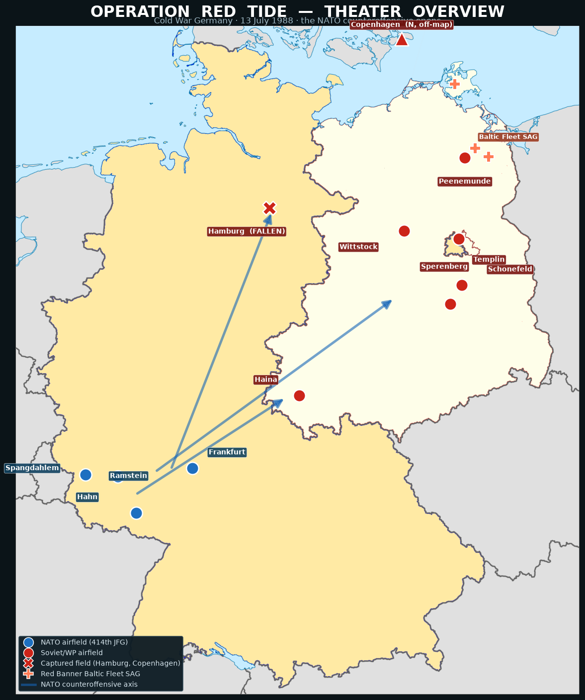
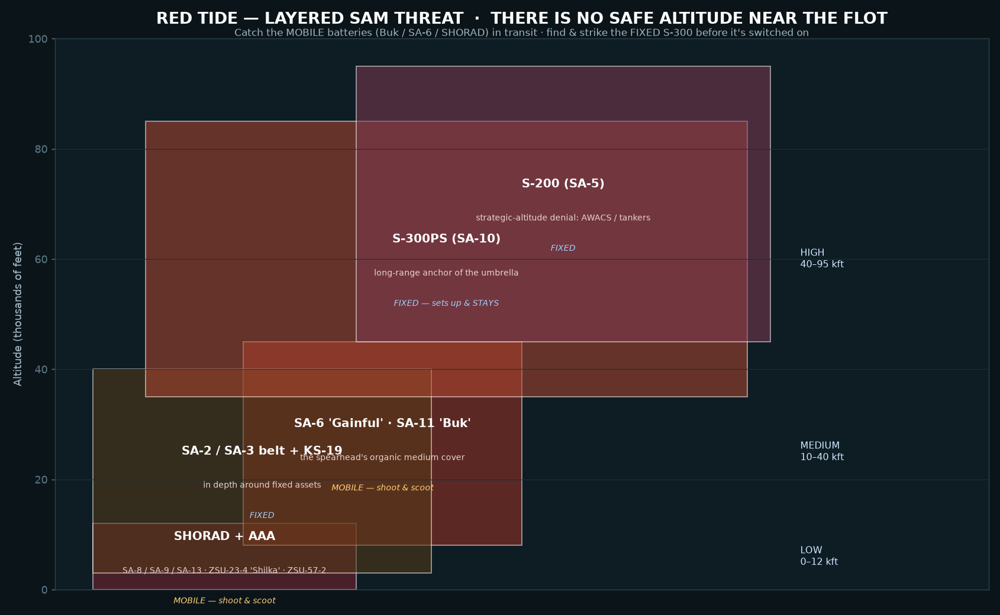
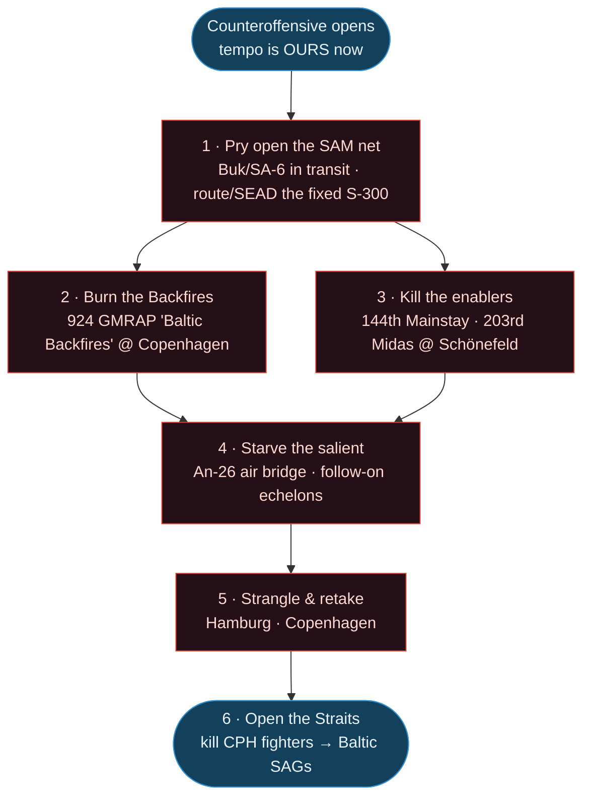

# Operation Red Tide — Visual Briefing

*A picture brief for **Germany - Red Tide**. The theater map and SAM profile are generated from
the campaign's actual airfield coordinates and order of battle; the flow/ORBAT charts render on
GitHub. For the full text product — assessment, kneeboard threat card, and read-aloud brief — see
**[red-tide-intel-assessment.md](red-tide-intel-assessment.md)**. To **build a brief** — real
friendly ORBAT, mission-brief template, package recipes, comms cards, and the phase plan — see the
**[Campaign Briefing Handbook](red-tide-campaign-handbook.md)**.*

> 🟡 **Provenance — this brief predates the build.** The **ORBAT diagram** matches `red_tide.yaml`
> and the airfields/threats are real, so the picture is sound. But the static **theater map** and
> **SAM-ring** PNGs are a *snapshot* — bases, the FLOT, and SAM positions move as the campaign is
> flown, so trust the live Retribution map over these images on the night. And the SAM rings are
> reach guidance, not a promise the **networked-IADS** "kill-C2" mechanic works (it was built for
> the retired Skynet engine; the fork now runs MANTIS — unverified in-game). File-grounded working
> reference: the **[Campaign Briefing Handbook](red-tide-campaign-handbook.md)**.

---

## Theater overview — 13 July 1988

The Warsaw Pact opened the war and overran **Hamburg** and **Copenhagen** (the ✕ fields). The
Soviet thrust has **culminated**, and the **414th JFG** — boxed into the south-west — now leads the
NATO counteroffensive (blue axes) to roll the front east and take it all back.

**Read it at a glance:** NATO holds the SW corner (Ramstein · Spangdahlem · Hahn · Frankfurt). Red
owns the centre, east, and the whole north — **Hamburg** captured, **Copenhagen** a Soviet
maritime-strike enclave (off the top of the map), and the **Red Banner Baltic Fleet** SAGs across
the approaches. The shaded **inner-German border** on the map is the old line; the Soviet thrust
drove *west* of it (Hamburg, Haina) before it culminated, and the counteroffensive (blue axes)
pushes back east to restore and pass it.

Base map: divided-Germany (FRG/DDR) outline supplied by the squadron; markers and axes are
plotted from the campaign's real GermanyCW airfield coordinates.

---

## The air-defense fight — a range fight, not an altitude one

The IADS is the center of gravity. You fly the deck–35k band, so you can't climb over these — the
**S-300 / S-200 are established and on**, and reach down to you inside their rings. **Route around
the fixed rings or commit dedicated SEAD; catch the mobile Buk / SA-6 / SHORAD in transit.**

---

## Target priority — how we win

---

## Red order of battle — by field *(names match the in-game ATO)*

```mermaid
graph TD
    HQ[["16th Air Army<br/>+ Baltic Fleet Aviation"]]:::hq

    HQ --> CPH["🛬 Copenhagen / Kastrup — FALLEN"]:::cap
    CPH --> CPH1["924 GMRAP 'Baltic Backfires' · Tu-22M3 ⚓"]:::pri
    CPH --> CPH2["'Naval Fulcrums' · MiG-29A"]:::u
    CPH --> CPH3["4 Gv Naval Assault · Su-24M"]:::u

    HQ --> HAM["🛬 Hamburg — FALLEN"]:::cap
    HAM --> HAM1["85 GvIAP · MiG-29A"]:::u
    HAM --> HAM2["357 Assault 'Grachi' · Su-25"]:::u
    HAM --> HAM3["336 'Krokodil' · Mi-24P"]:::u

    HQ --> SPB["Sperenberg — deep rear"]:::f
    SPB --> SPB1["1023 'Medved' · Tu-95MS"]:::u
    SPB --> SPB2["326 TBAP · Tu-22M3"]:::u
    SPB --> SPB3["831 GvIAP · Su-27"]:::u

    HQ --> SCH["Schönefeld — C2 / support"]:::f
    SCH --> SCH1["144 'Mainstay' · A-50 👁"]:::pri
    SCH --> SCH2["203 'Midas' · Il-78M ⛽"]:::pri

    HQ --> HAI["Haina — spearhead"]:::f
    HAI --> HAI1["33 IAP · MiG-23MLD"]:::u
    HAI --> HAI2["19 Gv · MiG-27K"]:::u
    HAI --> HAI3["368 'Grachi' · Su-25"]:::u

    HQ --> OTH["Templin · Wittstock · Peenemünde"]:::f
    OTH --> OTH1["185 GvIAP · MiG-21bis (real livery)"]:::u
    OTH --> OTH2["20 Gv · Su-17M4 · Coastal Fulcrums"]:::u

    classDef hq fill:#3a1020,stroke:#e0402f,color:#fff;
    classDef cap fill:#5a1622,stroke:#ff7b54,color:#ffd9d2;
    classDef f fill:#241016,stroke:#e0402f,color:#ffd9d2;
    classDef u fill:#181016,stroke:#7a3a3a,color:#e8c9c4;
    classDef pri fill:#7a2a18,stroke:#ffae84,color:#ffe;
```

*Highlighted: the priority kills — **924 GMRAP** Backfires, the **144th** Mainstay, the **203rd**
Midas.*

---

*All regiments, personalities, and the Soviet operation name ("ZAPAD") are fiction in the* Red Storm
Rising *tradition and freely editable. The theater map and SAM profile are generated from the real
GermanyCW airfield coordinates and the campaign's order of battle.*
