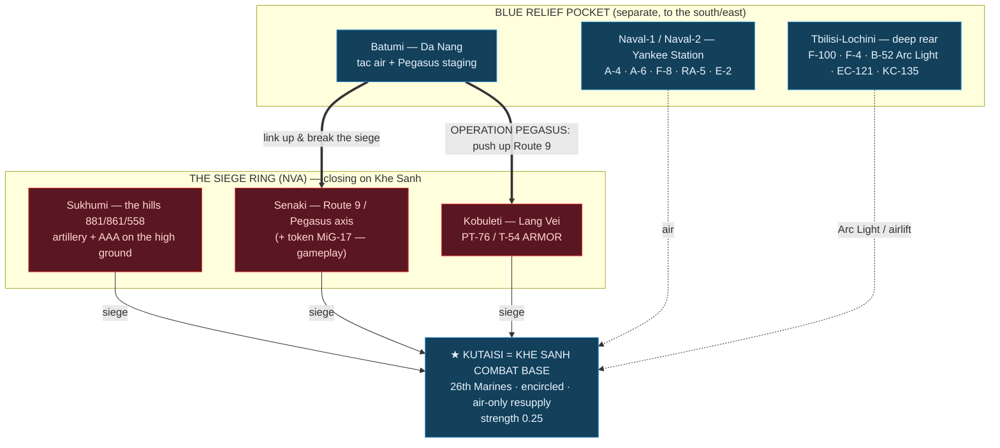
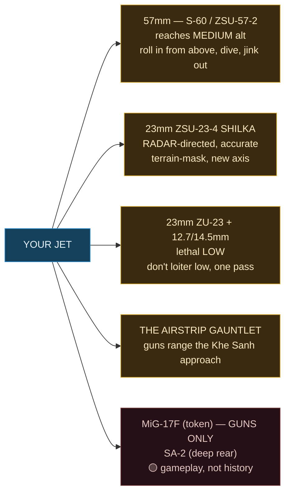
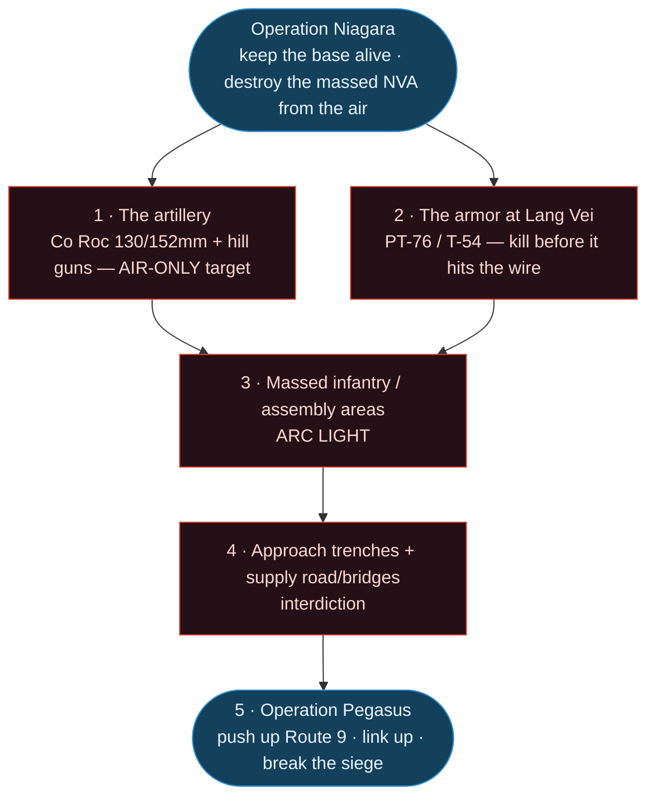

# Khe Sanh: Operation Niagara — Visual Briefing

*A picture brief for **Caucasus - Khe Sanh: Operation Niagara**. The diagrams render on GitHub and
the wiki. For the full text product — the historical intelligence assessment, kneeboard threat card,
and read-aloud brief — see **[khe-sanh-intel-assessment.md](Khe-Sanh-Intel-Assessment)**; for the
working brief-builder, the **[Campaign Briefing Handbook](Khe-Sanh-Campaign-Briefing)**.*

> 🟢🟡 **Rooted in history.** The order of battle, geography, and target priorities are the real
> siege (21 Jan – 9 Apr 1968), mapped onto the Caucasus terrain. Gameplay concessions (token MiG-17s,
> deep-rear SA-2, modern module stand-ins) are flagged. **No photographic theater map is bundled
> yet** — the schematics below stand in; a real annotated map/threat overlay can be added later.

---

## Historical imagery (1968)

*Real photographs of the siege — **public domain** US-military photos except where noted. They set
the scene; the Caucasus map is the play space. Full attribution in [Image credits](#image-credits--sources).*

**The lifeline under fire** — a C-130 on the strip amid supply pallets and smoke, 1968. *USAF (PD).*

**Aerial resupply** — unloading a 772nd TAS C-130B; the period caption notes a "mortar hole in the ramp." *USAF (PD).*

**Hill resupply by helo** — offloading a CH-53, 23 Jan 1968; the kind of run the "Super Gaggle" escorted through the flak. *USMC/USN (PD).*

**The airstrip gauntlet** — the strip, ranged by NVA guns on the approach. *USAF (PD).*

**The perimeter** — 26th Marines in the trenchline. *USMC Archives (CC BY 2.0).*

---

## The siege at a glance — 21 January 1968

Khe Sanh (Kutaisi) is **encircled**. Its only lifeline is air. Blue's relief pocket (Da Nang/Batumi
+ the carriers) is *separate* — the win is to break in along Route 9 (Operation Pegasus).

---

## The threat is flak, not missiles

No MiGs worth the name, no SAMs at the base, **no MANPADS** (none existed in 1968). You fly against
**guns** — and because there are no missiles, **medium altitude is comparatively safe.** The men who
died flew into the auto-AAA or made repeat passes.

---

## Target priority — how the air war wins

---

## Friendly air — Operation Niagara

```mermaid
graph TD
    HQ[["OPERATION NIAGARA<br/>Marine 1st MAW · Navy TF77 · USAF 7th AF"]]:::hq

    HQ --> KS["★ Khe Sanh / Kutaisi — besieged garrison air"]:::cap
    KS --> KS1["A-1H Skyraider 'Sandy' · CAS"]:::u
    KS --> KS2["OV-10 Bronco · FAC(A) 🟡 stand-in for O-1/O-2"]:::pri
    KS --> KS3["AH-1W · gunship · UH-1H medevac"]:::u

    HQ --> DN["Batumi — Da Nang"]:::f
    DN --> DN1["A-1H Skyraider · CAS"]:::u
    DN --> DN2["F-8E Crusader · BARCAP"]:::u
    DN --> DN3["CH-53E · UH-1H · lift"]:::u

    HQ --> CV["Yankee Station carriers"]:::f
    CV --> CV1["A-4E Skyhawk · A-6E Intruder · strike/CAS"]:::pri
    CV --> CV2["F-8E · BARCAP · E-2C · RA-5C recon"]:::u

    HQ --> RR["Tbilisi-Lochini — deep rear"]:::f
    RR --> RR1["B-52H · ARC LIGHT 🟡 stand-in for B-52D"]:::pri
    RR --> RR2["F-100D · F-4E · RF-101B recon"]:::u
    RR --> RR3["EC-121D AEW · KC-135 tanker · C-130 airlift"]:::u

    classDef hq fill:#0d2b45,stroke:#2f8fd0,color:#fff;
    classDef cap fill:#16405a,stroke:#5fb0e0,color:#eaf4ff;
    classDef f fill:#13303f,stroke:#2f6f90,color:#dceaf4;
    classDef u fill:#10202a,stroke:#3a6a7a,color:#cfe2ec;
    classDef pri fill:#1a4a2a,stroke:#5fd089,color:#e8ffe8;
```

*Highlighted: the workhorses — the **FAC(A)**, the **carrier strike** (A-4/A-6), and **Arc Light**.*

---

## Image credits & sources

All historical photographs come from **Wikimedia Commons** and are **public domain** as works of the
U.S. federal government, except the perimeter trenchline (CC BY 2.0, credited). **No copyrighted
press imagery is used** (no AP/UPI/Duncan/Leroy, etc.).

| Image | Author / source | License | Wikimedia Commons file |
|---|---|---|---|
| C-130 on the strip | U.S. Air Force | Public domain | `C-130 Hercules taking off from Khe Sanh 1968.jpg` |
| Marines unload C-130B | U.S. Air Force | Public domain | `Marines unload 772nd TAS C-130B at Khe Sanh 1968.jpg` |
| Marines offload CH-53 | U.S. Marine Corps / Dept. of the Navy | Public domain | `Marines offload a CH-53 at Khe Sanh, 23 January 1968.jpg` |
| Khe Sanh airstrip | U.S. Air Force | Public domain | `Khe Sanh Airport - 1968.jpg` |
| LBJ situation-room model | White House photo — Yoichi Okamoto | Public domain | `L B Johnson Model Khe Sanh.jpeg` |
| Perimeter trenchline | USMC Archives (Flickr) | CC BY 2.0 | `26 Marines trenchline.jpg` |

Files are committed to the repo at `docs/campaigns/img/khe-sanh/`; each original is at
`https://commons.wikimedia.org/wiki/File:<file name above>`.

---

*Order of battle, geography, and priorities are the historical siege mapped to Caucasus; gameplay
concessions are flagged 🟡. Full history + read-aloud brief:
[khe-sanh-intel-assessment.md](Khe-Sanh-Intel-Assessment). Working reference:
[Campaign Briefing Handbook](Khe-Sanh-Campaign-Briefing).*

---

*This page is the online copy of [`docs/campaigns/khe-sanh-visual-briefing.md`](https://github.com/bradyccox/414Ret/blob/main/docs/campaigns/khe-sanh-visual-briefing.md) in the repo. Edit that file; the wiki is mirrored from `docs/wiki/` on merge to `main`.*
